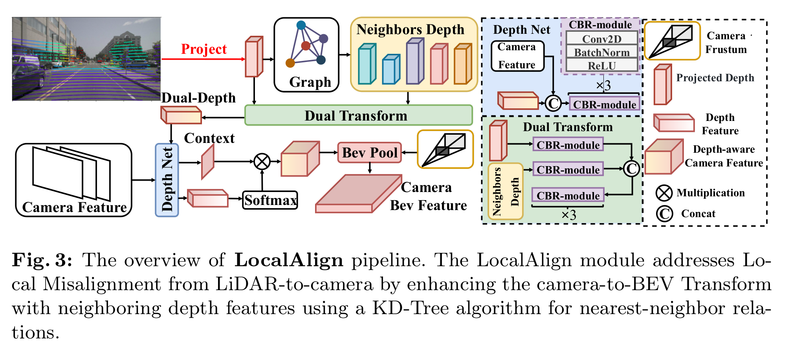

# 多模态3D目标检测论文综述

## DAL(2023.11)

### 基本信息

- **题目**：Detecting As Labeling: Rethinking LiDAR-camera Fusion in 3D Object Detection
- **作者**：Junjie Huang, Yun Ye, Zhujin Liang, Yi Shan, Dalong Du
- **机构**：Phigent Robotics, 北京
- **发表时间**：2023年11月（arXiv预印本）

### 核心内容

#### 研究问题

该论文关注LiDAR-相机融合的3D物体检测方法在算法开发中面临的过拟合问题。作者发现现有方法之所以容易过拟合，是因为违反了一些基本规则，特别是在回归任务预测中引入相机分支的特征，这与数据标注过程的基本原则相违背。

#### 解决方案

作者提出了"Detecting As Labeling"（检测即标注）的新视角，通过参考数据标注过程来设计检测算法。他们认为，在数据标注时有两个基本规则：

1. 应结合点云和图像搜索所有可能的候选物体并确定它们的类别
2. 当点云足够完整时，应该只根据点云生成每个实例的3D边界框

基于这一思想，作者提出了DAL（Detecting As Labeling）范式，它具有以下特点：

- 模仿数据标注过程构建预测流程
- 使用最简单的训练方式，只对图像骨干网络进行ImageNet预训练
- 提出实例级速度增强策略，解决速度分布不平衡问题

#### 实现方法

如图2所示，DAL的预测流程包括：

1. **密集感知阶段**：从图像和点云提取特征，并将图像特征转换到BEV空间，然后融合生成密集热图
2. **稀疏感知阶段**：选择热图中置信度最高的K个候选，收集其点云特征，然后使用前馈网络预测回归目标（中心、大小、方向、速度），这一阶段不使用图像特征
3. **分类阶段**：融合图像特征、图像BEV特征和点云BEV特征，用于物体类别预测

与其他方法不同，DAL在点云BEV特征和图像BEV特征融合之前进行特征提取，并且在回归任务中仅使用点云特征，这避免了视觉特征在回归任务中引入不稳定性。

#### 优势

1. 性能卓越：在nuScenes验证集上达到74.0 <u>NDS</u>，测试集上达到74.8 NDS
2. 速度与精度的优良平衡：如图1所示，DAL相比其他方法在相似推理速度下具有更高精度
3. 训练流程简单：不需要复杂的多阶段预训练或特殊学习率策略
4. 适应实际场景：通过速度增强策略解决了实际数据中速度分布不平衡问题（图3和图4）

### 创新点

1. 提出"检测即标注"的新理念，从数据标注过程中获得启发
2. 在回归任务中明确排除相机特征，防止过拟合
3. 设计了实例级速度增强策略，改善对移动物体的检测性能

## SparseFusion

### 基本信息

- **题目**：SparseFusion: Fusing Multi-Modal Sparse Representations for Multi-Sensor 3D Object Detection
- **作者**：Yichen Xie, Chenfeng Xu, Marie-Julie Rakotosaona等
- **机构**：加州大学伯克利分校，Google，加州理工学院
- **发表时间**：2023年4月（arXiv预印本）

### 核心内容

#### 研究问题

现有的LiDAR-相机融合方法大多采用密集特征表示（如BEV、体素或点表示），然而，对于3D物体检测任务，密集表示存在以下问题：

1. 冗余：物体只占3D空间的小部分
2. 噪声：复杂背景可能对检测性能有害
3. 低效：模态间对齐耗时（生成BEV特征需要500毫秒）

#### 解决方案

作者提出了SparseFusion，这是一种新型多传感器3D检测方法，它同时利用稀疏候选和生成稀疏表示。如图1c所示，SparseFusion的关键思想是：

1. 在图像和点云两种模态中分别提取稀疏的实例级特征
2. 将它们投影到统一的3D空间中
3. 使用轻量级自注意力模块进行融合

作者首先识别了现有方法的四个关键组件（表1），并将方法分为四类：

- Dense+Sparse→Dense
- Dense+Dense→Dense
- Sparse+Dense→Sparse
- Dense+Dense→Sparse

然后提出了新的第五类：Sparse+Sparse→Sparse（SparseFusion属于此类）。

#### 实现方法

如图2所示，SparseFusion包括三个主要部分：

1. **平行模态特定检测**：
   - LiDAR分支：从点云中提取BEV特征，使用变换器生成稀疏实例特征
   - 相机分支：从多视图图像中提取特征，生成稀疏实例特征
2. **视图变换**：将相机模态的候选变换到LiDAR坐标空间
   - 解耦相机候选的表示
   - 编码投影后的边界框和相机参数
3. **交叉模态信息迁移**（图3）：
   - 几何迁移：从LiDAR到相机，提供精确的深度信息
   - 语义迁移：从相机到LiDAR，提供丰富的语义信息

融合阶段，如图6所示，通过自注意力机制融合两种模态的实例特征，允许跨实例和跨模态信息交互。

#### 优势

1. 最先进的性能：在nuScenes测试集上达到73.8 NDS和72.0 mAP
2. 更快推理速度：比最新方法快1.8倍（5.6 FPS vs 3.1 FPS）
3. 高效：使用稀疏表示大大减少了计算量
4. 充分利用不同模态优势：如图5所示，LiDAR和相机对不同类别和距离的物体检测能力互补

### 创新点

1. 首次提出完全利用稀疏候选和稀疏表示的LiDAR-相机融合方法
2. 通过平行检测策略，充分利用各模态优势
3. 设计了交叉模态信息迁移模块，缓解模态间负迁移问题

## 两种方法对比与启示

这两篇论文都是针对LiDAR-相机融合的3D物体检测研究，但各自从不同角度提出了创新性解决方案：

- DAL专注于遵循数据标注的基本原则，强调在回归任务中不使用相机特征以避免过拟合
- SparseFusion则从稀疏表示的角度出发，减少冗余计算并提高效率

两者都取得了出色的性能，同时显著提高了推理速度，为多模态3D物体检测提供了不同的优化方向。

# 基于LiDAR-相机融的3D目标检测综述

## SparseFusion(2023.04)

### 1. 论文基本信息

- **题目**：SparseFusion: Fusing Multi-Modal Sparse Representations for Multi-Sensor 3D Object Detection
- **作者**：Yichen Xie, Chenfeng Xu, Marie-Julie Rakotosaona, Patrick Rim, Federico Tombari, Kurt Keutzer, Masayoshi Tomizuka, Wei Zhan
- **机构**：University of California, Berkeley; Google; California Institute of Technology
- **发布时间**：2023年4月

### 2. 主要内容

#### 研究背景与问题

论文指出，现有的LiDAR-相机融合方法主要分为四类（见表1），但都要么使用密集候选，要么产生密集场景表示，这在计算上效率低下且容易受到噪声背景的影响，尤其是考虑到3D场景中物体只占据很小一部分空间。

具体问题包括：

1. 密集表示（如BEV）计算效率低下，如从多视图图像生成BEV特征在RTX 3090 GPU上需要500ms
2. 多模态特征之间存在显著的域差距，使得特征交互变得困难
3. 现有方法需要堆叠多个Transformer层构建复杂解码器解决域差距问题

#### 提出的解决方法

作者提出了SparseFusion方法，这是首个同时使用稀疏候选和稀疏表示的LiDAR-相机融合方法：

1. **方法架构**（图2）：

   

   - 并行的模态特定检测器：分别在LiDAR和相机分支进行3D目标检测
   - 将相机候选变换到LiDAR坐标空间：通过解耦物体表示（分离类别和3D边界框表示）
   - 使用轻量级自注意力模块融合多模态实例特征

2. **跨模态信息传递**（图3）：

   - **几何传递**：将LiDAR点云投影到多视图图像生成稀疏深度图，与图像特征拼接形成深度感知图像特征
   - **语义传递**：将LiDAR点云投影到图像上，聚合多尺度特征并与BEV特征结合，通过可变形注意力生成语义感知BEV特征

3. **损失函数设计**：

   - 对初始化的查询使用高斯焦点损失
   - 分别为LiDAR和相机模态特定检测器设计损失函数
   - 使用Hungarian算法进行匹配，应用焦点损失进行分类，L1损失进行3D边界框回归

#### 实验结果

1. 在nuScenes测试集上达到73.8 NDS和72.0 mAP，超过所有现有方法
2. 实现了最快的推理速度：在A6000 GPU上达到5.6 FPS，比最近的SOTA方法DeepInteraction快1.8倍
3. 模态特定检测分析（图5）显示：
   - LiDAR更适合检测汽车、卡车等刚性物体
   - 相机在检测远距离物体时有明显优势
   - 两种模态能互相补充，弥补各自的缺点

### 3. 优缺点分析

#### 优点

1. 高效：稀疏表示和轻量级融合方法显著提高了推理速度，是所有方法中最快的
2. 有效：通过跨模态信息传递减少了多模态间的负迁移影响
3. 模块化：可以方便地与不同的LiDAR或相机检测器结合使用
4. 先进：在性能和速度方面都超过了现有方法

#### 缺点

1. 融合效果依赖于模态特定检测器的质量，如果单模态检测器表现不佳，可能会影响整体性能
2. 对于极端场景（如恶劣天气）下LiDAR和相机数据极度不匹配的情况，可能表现不佳
3. 实验中主要在nuScenes数据集上验证，在其他数据集上的泛化性需要进一步验证

#### 适用范围

- 适用于需要高效率3D物体检测的场景，特别是自动驾驶
- 特别适合需要实时性能的系统，能在保持高精度的同时实现快速推理
- 对于物体稀疏分布的场景效果更好
- 在多模态数据高度不一致的极端场景可能性能下降

## DAL(2023.11)

### 1. 论文基本信息

- **题目**：Detecting As Labeling: Rethinking LiDAR-camera Fusion in 3D Object Detection
- **作者**：Junjie Huang, Yun Ye, Zhujin Liang, Yi Shan, Dalong Du
- **机构**：Phigent Robotics, 北京, 中国
- **发布时间**：2023年11月

### 2. 主要内容

#### 研究背景与问题

该论文指出LiDAR-相机融合在3D目标检测中遇到了算法开发过程中的过拟合问题，这源于违反了一些基本规则。作者从数据集构建中的标注过程获得启发，提出了"Detecting As Labeling"（检测即标注）的概念。

现有方法存在以下问题：

1. 需要复杂的训练策略（如多阶段预训练、自定义学习率策略等）
2. 在回归任务（位置、大小、方向等）预测中引入了相机分支的特征，违反了基本规则
3. 训练依赖复杂，增加了实际使用的不确定性

#### 提出的解决方法

作者提出了"Detecting As Labeling"理论，并构建了名为DAL的范式：

1. 基于数据标注过程中的两个关键规则：

   - **规则A**：应该结合点云和图像来搜索所有可能的候选物体并确定其类别
   - **规则B**：当点云足够完整时，每个实例的3D边界框应该只根据点云生成

2. DAL网络架构（图2）：

   

   - **密集感知阶段**：图像和点云特征分别提取后融合生成密集热图，用于生成候选
   - **稀疏感知阶段**：只使用点云特征进行回归任务（位置、大小、方向、速度），不涉及图像特征
   - **类别预测**：融合图像特征、图像BEV特征和点云BEV特征进行最终分类

3. 创新点：

   - 简化训练流程，只需加载ImageNet预训练的图像骨干网络
   - 提出了速度增强策略解决训练数据中速度分布不平衡问题
   - 修改了BEVFusion架构，将点云BEV特征和图像BEV特征在密集BEV编码器之后融合，而不是之前

#### 实验结果

1. 在nuScenes测试集上达到了74.8 NDS，超过所有现有方法
2. 在nuScenes验证集上，DAL-Large实现了71.5 mAP和74.0 NDS
3. 提供了三种配置（DAL-Tiny、DAL-Base、DAL-Large），在速度和精度之间提供了不同的权衡
4. 相比现有方法，训练流程大大简化，如表1所示

### 3. 优缺点分析

#### 优点

1. 理论基础扎实，基于数据标注过程中的实际规则
2. 实现简单，没有使用复杂的训练策略，更易于实际部署
3. 性能优异，在benchmark上表现超过所有现有方法
4. 提供了速度和精度的良好权衡，适用于实时应用场景

#### 缺点

1. 未考虑LiDAR范围之外的物体检测，如论文局限性部分所述
2. nuScenes数据集中的简单分类任务限制了DAL应用更高级的图像骨干网络
3. 对于点云非常稀疏的远距离物体，性能可能有限

#### 适用范围

- 适用于自动驾驶等需要高精度、实时3D物体检测的场景
- 主要针对点云覆盖范围内的物体检测
- 不太适合处理超出LiDAR范围的远距离物体检测

# DeepInteraction++(2025.02)

## 1. 论文基本信息

- **标题**：DeepInteraction++: Multi-Modality Interaction for Autonomous Driving
- **作者**：Zeyu Yang, Nan Song, Wei Li, Xiatian Zhu, Li Zhang, Philip H.S. Torr
- **机构**：复旦大学数据科学学院、南洋理工大学、萨里大学、牛津大学
- **发表年份**：202502（扩展自NeurIPS 2022的DeepInteraction论文）
- **期刊**：JOURNAL OF LATEX CLASS FILES, VOL. 14, NO. 8

## 2. 主要内容

### 解决的问题

该论文解决了自动驾驶领域中多模态融合的一个根本性问题：现有方法通常将不同模态数据（如LiDAR点云和相机图像）融合为单一的混合表示，这种做法往往会丢失各个模态独有的表示优势。具体来说：

- 传统的**模态融合(modality fusion)**策略存在三种形式：输入层融合、特征层融合和提议层融合
- 前两种融合往往偏向于LiDAR模态，对图像模态的利用不充分
- 提议层融合则完全忽略了两种模态在表示学习过程中的内在关联
- 这些方法均未充分利用模态的互补性，影响了检测性能

### 解决方法

论文提出了一种新颖的**模态交互(modality interaction)**策略，称为DeepInteraction++。如图1(b)所示，该方法不同于传统融合模式，维持两个特定于模态的表示，并在整个检测流程中保持它们的独立性，同时实现信息交互。

**框架主要包含两个核心组件**：

1. **多模态表示交互编码器(encoder)**：
   - 采用**双流Transformer架构**，如图2(a)所示
   - 包含**多模态表示交互(MMRI)**模块，分为图像到LiDAR(I2L)和LiDAR到图像(L2I)两种交互
   - 实现了**LiDAR引导的跨平面极坐标注意力**，有效利用密集图像特征
   - 使用**可变形注意力(deformable attention)**替代原有的独立注意力机制，提供更灵活的感受野
   - 引入**分组稀疏注意力**机制降低内存消耗
2. **多模态预测交互解码器(decoder)**：
   - 如图3所示，通过交替聚合不同模态表示的信息，迭代细化预测结果
   - 设计了**多模态预测交互层(MMPI)**，分别基于图像和LiDAR模态提炼检测结果
   - 使用**RoI特征提取**捕获图像和LiDAR BEV表示中的物体语义信息

相比原始DeepInteraction，DeepInteraction++的主要改进包括：

- 使用双流Transformer架构替代基于FFN的表示集成，提高可扩展性
- 引入可变形注意力机制，实现多尺度交互
- 添加LiDAR引导的跨平面极坐标注意力，增强稠密特征利用
- 应用分组稀疏注意力，优化运行时和内存需求
- 将应用范围扩展到端到端自动驾驶任务

### 实验结果

论文在nuScenes数据集上进行了大量实验，结果表明：

1. **检测性能**：
   - 如表I所示，在nuScenes测试集上达到72.0% mAP和74.4% NDS，超过大多数SOTA方法
   - 与Transfusion相比，提高了2.4% mAP和1.3% NDS
   - 表III显示，在不同图像骨干网络下，DeepInteraction++始终优于原始DeepInteraction
2. **端到端自动驾驶性能**：
   - 表XIII显示，在规划任务上平均L2误差为0.70m，碰撞率为0.19%，优于现有方法
   - 表XIV表明，在感知和预测任务上也有显著提升
3. **计算效率**：
   - 表II显示，在NVIDIA RTX A6000 GPU上达到3.9 FPS，比许多竞争方法更高效
   - 图7展示了性能提升与计算开销的权衡关系
4. **消融研究**：
   - 表IV证明了多模态表示交互和预测交互的有效性
   - 表V-VII验证了各种设计选择的合理性，如极坐标注意力、编码器层数等

### 优点和缺点

**优点**：

1. 创新性地提出了模态交互策略，保持模态特定表示独立性的同时实现有效交互
2. 双流Transformer架构和可变形注意力机制提供了更强的表示能力
3. LiDAR引导的跨平面极坐标注意力有效利用了密集图像特征
4. 在3D目标检测和端到端自动驾驶任务上都取得了SOTA性能
5. 表XI显示，该方法对各类物体均有性能提升，包括难以检测的小物体
6. 如图8所示，在端到端规划任务中具有更准确的轨迹规划能力

**缺点**：

1. 如图9所示，对缺乏LiDAR信号的物体可能会出现漏检
2. 依赖精确的LiDAR引导3D映射，对传感器错位或故障敏感
3. 相比单模态方法，计算复杂度更高，需要更多的计算资源
4. 端到端框架中的地图分割和运动预测问题尚未完全解决

### 适用范围

**适用情况**：

1. 适用于同时装备LiDAR和相机传感器的自动驾驶系统
2. 适用于需要高精度3D目标检测的场景
3. 适用于完整的端到端自动驾驶系统，包括感知、预测和规划
4. 可扩展到其他多模态感知任务，如BEV地图分割

**不适用情况**：

1. 计算资源有限的嵌入式系统
2. 仅有单一模态数据的场景
3. 传感器存在严重错位或故障的情况
4. 对实时性要求极高的应用场景（虽然性能已经很好，但仍有优化空间）

## 3. 结论与影响

DeepInteraction++通过创新的模态交互策略，解决了多模态3D目标检测的根本性问题，不再简单地将不同模态融合为单一表示，而是维持各自独立性的同时实现有效交互。这一方法不仅在3D目标检测上取得了SOTA性能，还成功扩展到了端到端自动驾驶任务，展示了良好的通用性。

论文的主要贡献在于提出了一种新的多模态学习范式，并通过精心设计的双流Transformer架构、可变形注意力机制和LiDAR引导的跨平面极坐标注意力等技术手段实现了有效的模态交互。这些思想对自动驾驶领域的多模态感知研究提供了新的思路和方向。

## GraphBEV(2025.03)

### 1. 论文基本信息

- **标题**：GraphBEV: Towards Robust BEV Feature Alignment for Multi-Modal 3D Object Detection
- **作者**：Ziying Song, Lei Yang, Shaoqing Xu, Lin Liu, Dongyang Xu, Caiyan Jia, Feiyang Jia, Li Wang
- **机构**：北京交通大学、清华大学、澳门大学、北京理工大学
- **发表时间**：2025年3月13日（根据arXiv版本信息）
- **代码链接**：https://github.com/adept-thu/GraphBEV

### 2. 论文解决的问题

在自动驾驶领域，多模态融合方法（如BEVFusion）将LiDAR和相机信息整合到Bird's-Eye-View(BEV)表示中，以提高3D物体检测性能。然而，这些方法容易受到传感器之间不准确校准关系的影响，主要表现在两个方面：

1. **局部错位问题**：LiDAR到相机的投影误差导致相机分支中的深度估计不准确
2. **全局错位问题**：LiDAR和相机BEV特征在融合时存在对齐偏差

这些问题在实际应用场景中不可避免，如路面振动导致的标定误差无法通过在线校准完全纠正，严重影响了现有BEV融合方法在实际环境中的应用。

### 3. 解决方法

论文提出了GraphBEV框架，主要包含两个创新模块：

#### LocalAlign模块

如图3所示，该模块解决局部错位问题，具体实现包括：

1. 利用KD-Tree算法为LiDAR到相机投影的深度值找到邻近深度信息，构建K个最近邻
2. 通过双深度变换(Dual Transform)模块同时处理投影深度和邻域深度
3. 将深度特征与相机特征融合，生成考虑邻域信息的可靠深度表示
4. 通过BEV池化操作完成相机到BEV的转换，得到更准确的相机BEV特征

实现细节：

- 使用KD-Tree算法找到每个投影像素的K个最近邻（Kgraph=8）
- 通过卷积、批归一化和ReLU激活函数构建双深度变换模块
- 将深度感知的相机特征通过BEV池化转换到BEV空间

#### GlobalAlign模块

如图4所示，该模块解决全局错位问题：

1. 在训练阶段，对相机BEV特征引入随机偏移噪声，模拟真实环境中的全局错位
2. 通过MM-Align模块学习偏移，生成偏移网格(Offset Grid)
3. 通过网格采样(Grid Sample)对LiDAR BEV特征进行空间变换，生成形变权重
4. 将形变权重与LiDAR BEV特征相乘，实现特征动态调整
5. 通过基本卷积操作生成最终的对齐BEV特征

训练策略：

- 仅在训练阶段添加偏移噪声，测试阶段使用学习到的偏移进行前向推理
- 使用融合和卷积后的特征作为监督信号
- 通过均方误差损失函数优化对齐效果

### 4. 实验结果

#### 检测性能

如表1所示，在nuScenes验证集上：

- GraphBEV达到70.1%的mAP和72.9%的NDS，超过基线BEVFusion 1.6%的mAP
- 在nuScenes测试集上达到71.7%的mAP，超过BEVFusion 1.5%

#### 抗噪能力

如表3所示，在添加错位噪声的条件下：

- BEVFusion的mAP从68.5%下降到60.8%（下降7.7%）
- GraphBEV的mAP仅从70.1%下降到69.1%（下降1.0%）
- GraphBEV比BEVFusion在噪声环境下高出8.3%的mAP

#### 对小物体的检测能力

GraphBEV在小物体检测上表现突出：

- Barrier类别提升4.0%
- Bike类别提升2.2%
- Pedestrian类别提升2.7%

这表明小物体对特征错位更敏感，GraphBEV能有效减轻这一影响。

#### 鲁棒性分析

如表5和表6所示，GraphBEV在不同条件下都表现良好：

- 不同天气条件（晴天、雨天、白天、夜间）均有稳定表现
- 对远距离物体（>30m）检测性能提升明显（从40.0%提升到42.1%）
- 对小尺寸物体检测能力大幅提高（从50.3%提升到55.4%）

### 5. 优缺点分析

#### 优点

1. 不改变BEVFusion的基本范式，通过两个模块增强其鲁棒性
2. 在实际应用场景中的标定误差问题上提供了有效解决方案
3. 显著提高了对小物体和远距离物体的检测能力
4. 在BEV Map分割任务上也展现了良好的泛化能力（如表2所示）
5. 对不同天气条件具有稳定性能，特别是在夜间场景中表现明显优于BEVFusion

#### 缺点

1. 增加了一定的计算延迟（从BEVFusion的133.2ms增加到GraphBEV的140.9ms）
2. 需要调整Kgraph超参数来获得最佳性能，如表4所示，不同Kgraph值对性能影响较大
3. 虽然在添加噪声的条件下表现良好，但实际应用中的噪声可能比模拟噪声更复杂

### 6. 适用范围

GraphBEV主要适用于：

1. 自动驾驶系统中的多模态3D物体检测
2. 存在传感器标定误差的实际应用场景
3. 需要准确检测小物体或远距离物体的场景
4. BEV表示的多模态融合方法

局限性：

1. 主要针对LiDAR和相机融合，可能不适用于其他多模态组合
2. 需要特定参数设置来获得最佳性能
3. 虽然减轻了错位问题，但无法完全消除标定误差的影响

### 7. 总结

GraphBEV通过解决特征错位问题，有效提高了多模态3D物体检测在实际场景中的鲁棒性。它的主要贡献在于引入了LocalAlign和GlobalAlign两个模块，分别解决局部和全局错位问题。实验结果表明，GraphBEV不仅在标准数据集上表现出色，在添加错位噪声的条件下性能更加稳定，特别是对小物体和远距离物体的检测能力有显著提升。这为多模态3D物体检测在自动驾驶实际应用中的落地提供了重要支持。

